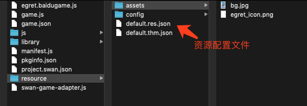

# 白鹭引擎资源使用说明
白鹭引擎使用的游戏资源，都要用一个 `json` 文件来管理配置。


如上图所示，该项目里使用了2个图片, `default.res.json`是配置文件，内容如下:

```
{
	"groups": [
		{
			"keys": "bg_jpg,egret_icon_png,description_json",//当前组里有哪些文件
			"name": "preload"//要加载的组的名称
		}
	],
	"resources": [
		{
			"url": "assets/bg.jpg",//图片与配置文件的相对路径
			"type": "image",//文件类型
			"name": "bg_jpg"//文件的缩写名
		},
		{
			"url": "assets/egret_icon.png",
			"type": "image",
			"name": "egret_icon_png"
		},
		{
			"name": "description_json",
			"type": "json",
			"url": "config/description.json"
		}
	]
}

```

这个配置文件里面有一个资源组 `preload`，组里有2个图片和一个json。通过引擎的资源加载模块加载`preload` 这个组以后，里面包含的所有资源都会逐一加载到。

```
//加载配置文件
await RES.loadConfig("resource/default.res.json", "resource/");
//加载 preload 这个组
await RES.loadGroup("preload");

let bitmap = new egret.Bitmap();
//RES 是白鹭的资源管理模块，通过文件缩写名来获取到这个图片
bitmap.texture = RES.getRes("bg_jpg")
this.addChild(bitmap)
```

在小游戏项目中，因为有包体的大小限制，包内一般只有少量的图片，大量的资源会放到远程 CDN 上。
在本示例里，附件里的`远程资源` 我传到了我们的测试服务器上，配置文件的地址为：https://microclient.egret-labs.org/test/resource/baidu.res.json 


```
{
	"groups": [
		{
			"keys": "checkbox_select_disabled_png,checkbox_select_down_png...",
			"name": "ui"
		}
	],
	"resources": [
		{
			"url": "assets/CheckBox/checkbox_select_disabled.png",
			"type": "image",
			"name": "checkbox_select_disabled_png"
		},
		...
```
在这个配置文件里，包含一个组 `ui`。那么在游戏中，一共需要加载2个配置文件和2个组。代码如下：

```
//加载本地的配置文件
await RES.loadConfig("resource/default.res.json", "resource/");
//加载远程的配置文件
await RES.loadConfig("baidu.res.json", "https://microclient.egret-labs.org/test/resource/");
//加载本地的配置文件里的 preload 组
await RES.loadGroup("preload", 0, loadingView);
//加载本地的配置文件里的 ui 组
await RES.loadGroup("ui", 0, loadingView);
```
在示例demo里，每个资源配置文件只有一个组，但是在真实的游戏里，根据业务需求会有若干个组，比如一个关卡就有一个组，一个场景一个组等等。
