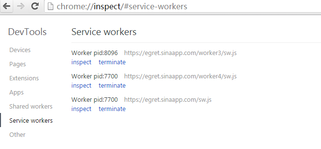
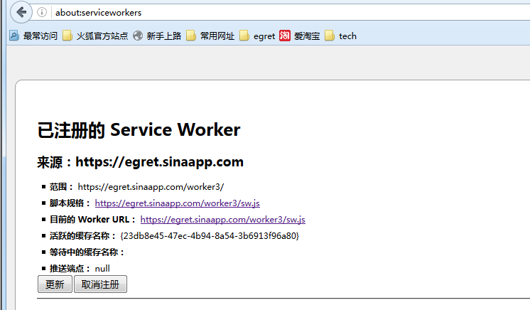
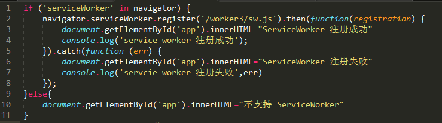
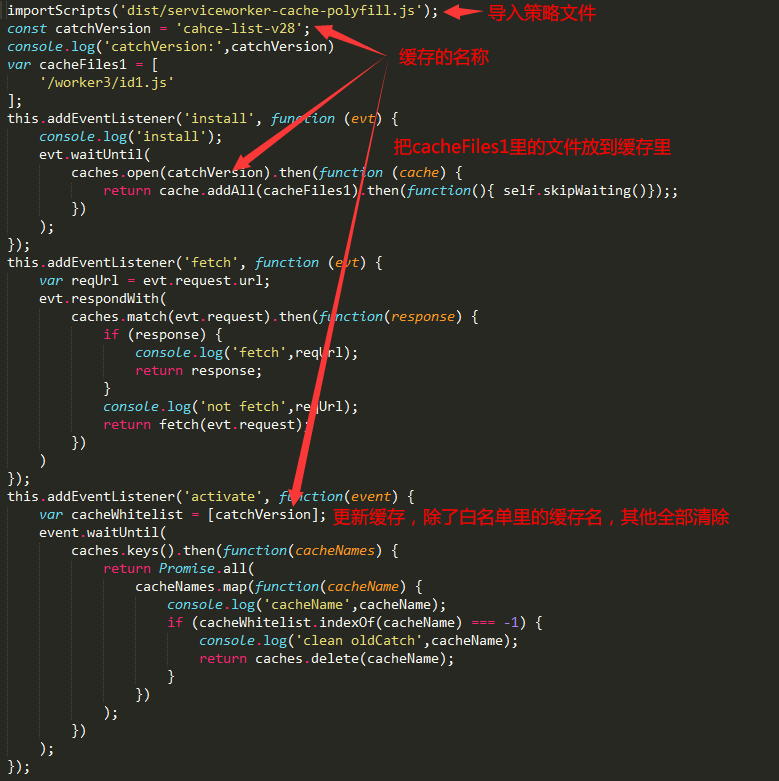
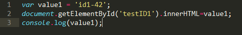

Service Worker

Service worker 是一段运行在浏览器后台进程里的脚本，它独立于当前页面，目前的主要功能是拦截和处理网络请求，主要用于缓存管理。

在 chrome 中输入 `chrome://inspect/#service-workers` 可以看到当前运行的 service worker



在 firefox 中输入`about:serviceworkers` 也有类似的功能




一般js文件的引用都是相对路径，但 Service worker 比较特殊，很多时候都要以根目录为路径的起点。

比如我的项目是在这个地址 https://egret.sinaapp.com/worker3。

很多要写路径的地方都要加上"/worker3/"

下面是一个示例,演示一下缓存管理。
```

项目结构

www/worker3/
	index.html 入口html
    main.js 主文件，注册service worker
    sw.js service worker代码
    id1.js 用来演示缓存的文件
    id2.js 用来演示缓存的文件
    dist/serviceworker-cache-polyfill.js  缓存策略
```
下面是 main.js 的代码



这里有个地方要注意，`erviceWorker.register('/worker3/sw.js')`，这个注册路径要以根域名为路径的起点，虽然我们的代码已经放到 worker3 目录下了，但还是要写上。


下面是 sw.js 的代码



cacheFils1 里面是要缓存的文件列表，同样要以根域名为路径的起点


代码里主要监听了3个事件。

* install------只要sw.js 这个文件里的代码更新了，就会监听到这个事件，页面刷新的时候不会触发。所以一般都在这个时候缓存文件。注意这里面最后有个`self.skipWaiting()`的方法。这个方法非常重要，目的是告诉浏览器当前的 serviceWorker 立刻生效。如果不加的话，你刷新页面，还是老的 serviceWorker 在运行，而新的 serviceWorker 还处于等待中，不会生效，只有关闭了浏览器，重新打开后才会生效。网上的教程都没加，非常坑人。

* fetch------ 页面刷新的时候监听到。一般是在这里做缓存使用的判断，如果缓存列表里有的内容就拦截 request 请求，直接返回缓存里的，没有的话再从真正的服务器上拿。另外还可以在这里做增量缓存。

* activate------在 install 之后监听到这个事件。一般用于清理缓存用。除了白名单里的，其他的缓存全部清除。所以要是想把原来的缓存全部清除，只要把 catchVersion 这个缓存名称改了，这样就能把老的缓存清除掉，保留新的缓存。


下面是 id1.js 和 id2.js



这两个文件主要是用来测试缓存的.当你把 value 的值修改了，id1.js 因为被缓存了，console 出来的还是老的值。id2.js 没缓存，console 出来的是新的内容。


上图可以看到，启动 service worker 后， chrome 中的网络请求会显示 from ServiceWorker


下面是一些要注意的问题。

* Service worker 一定要在运行在 https 的服务器上。

* Service worker 拥有一个完全独立于Web页面的生命周期。比如用chrome 打开一个启动了 Service worker 的网页，即便关掉这个标签页，Service worker 还是会在后台运行，这个进程什么时候关闭，是由浏览器自动控制的，我们没法干预。

* 如果一个页面是刚刚注册了service worker，那么它这一次不会被接管，到下一次刷新页面的时候，service worker才会生效。

* 调试的时候最好 chrome 和 firefox 两个浏览器都开着，service worker 还有兼容性问题，有时候 chrome 出错了但没有提示，firefox 会有具体的提示。另外有的时候注释里有中文 firefox 会报错。


附件是全部的代码。worker4增加了一个小功能，在 id2.js 里会发送一个请求，serviceworker 里会拦截这个消息，返回一个自定义的值。


一些相关的教程

[mozilla 官方 API 说明](https://developer.mozilla.org/en-US/docs/Web/API/Service_Worker_API)

http://www.w3ctech.com/topic/866

http://www.tuicool.com/articles/ieeEBr

http://web.jobbole.com/84792/

http://imweb.io/topic/56592b8a823633e31839fc01

http://www.07net01.com/2016/01/1102314.html

http://www.open-open.com/lib/view/open1426815580164.html


